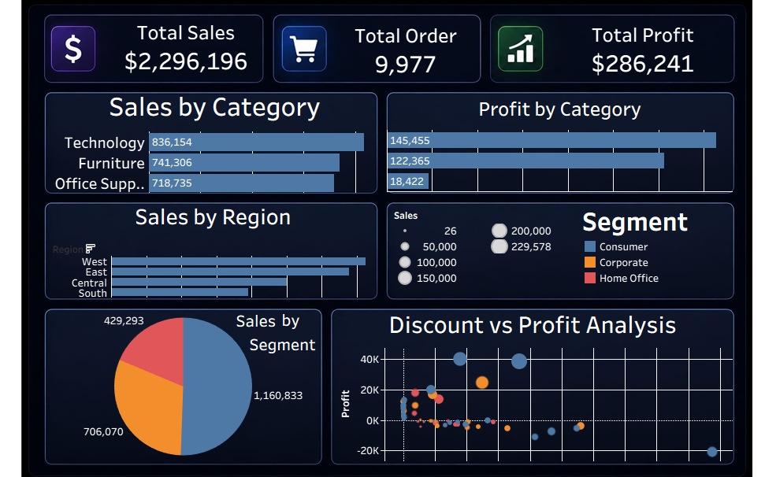

# Super-Store-Sales-Analysis

## Project Overview

This is an end-to-end Data Analysis project based on the Sample SuperStore dataset. The project demonstrates the complete data analysis workflow, including data cleaning in Microsoft Excel, business analysis using SQL, and interactive dashboard creation in Tableau.

## Dashboard Preview

## Tools Used

- Microsoft Excel (Data Cleaning)
- SQL (Business Analysis)
- Tableau (Dashboard & Data Visualization)

## Dataset

- Source: Sample SuperStore Dataset (Kaggle)
- Cleaned using Microsoft Excel before analysis.
- Contains sales, quantity, discount, profit, category, sub-category, region, state, city, ship mode, segment, country, and postal code.

## Project Structure

This project contains the following folders:

- **Dataset** - Contains the cleaned dataset and README file.
- **SQL** - Contains all SQL queries used for data analysis.
- **Tableau** - Contains the Tableau dashboard (.twbx), dashboard preview image, and README file.

## SQL Analysis

The SQL folder contains 20 business analysis queries, including:

- Total Sales
- Sales by Category
- Sales by Region
- Sales by Segment
- Total Orders
- Total Profit
- Profit by Category
- Discount vs Profit Analysis
- Top States by Sales
- Top Cities by Profit
- Sales by Sub-Category
- Profit by Region
- Quantity by Category
- Average Discount by Category
- Top Profitable Sub-Categories
- Loss-Making Sub-Categories
- High Discount Orders
- High Sales but Low Profit
- Profit Margin by Category
- Category Performance Comparison

## Insights

- Technology generated the highest sales and profit.
- Some sub-categories generated losses despite having good sales.
- Higher discounts did not always increase profit.
- Sales and profit varied across different regions.
- Profit margin was different for each category.
- The dashboard helps identify profitable products and business trends.

## Author 
**Tanya Sagar**

